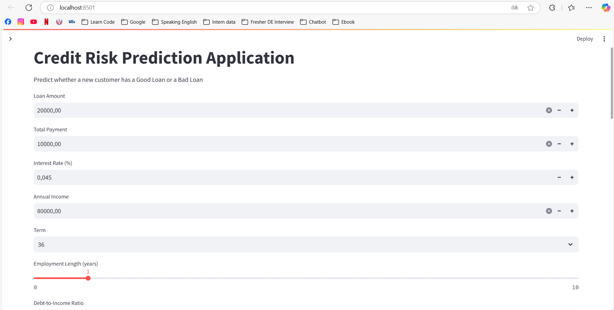
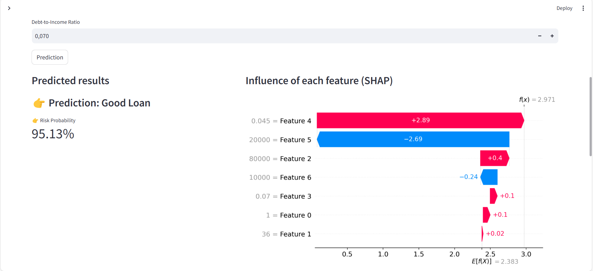
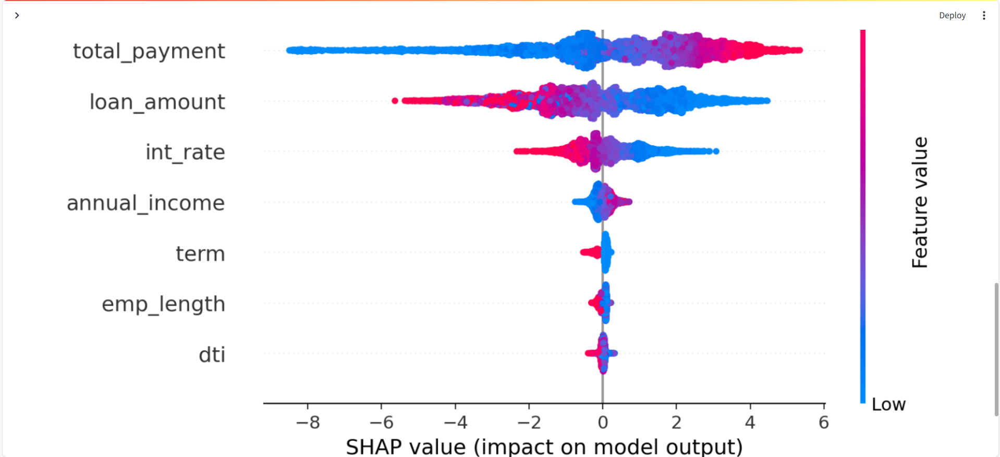
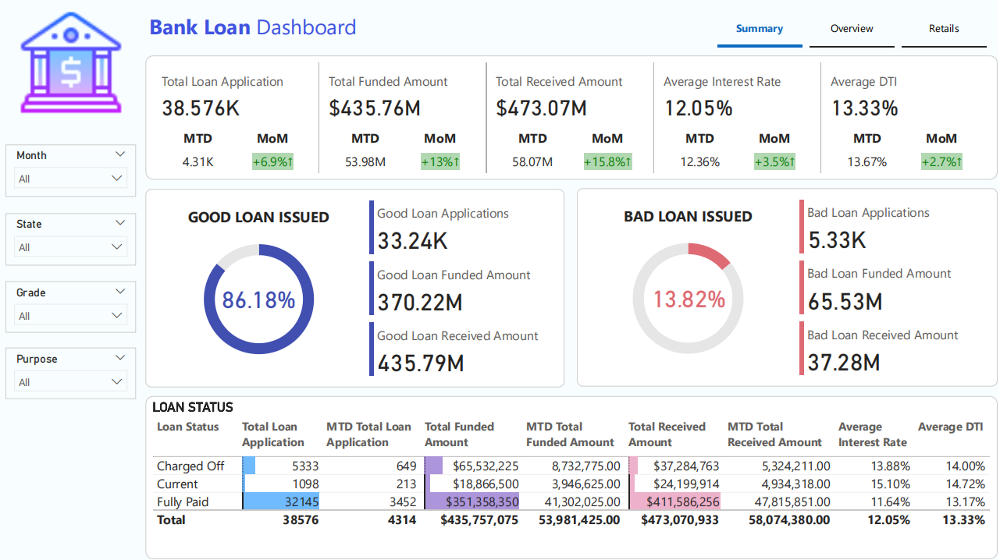
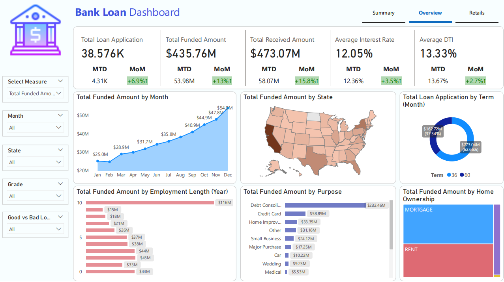
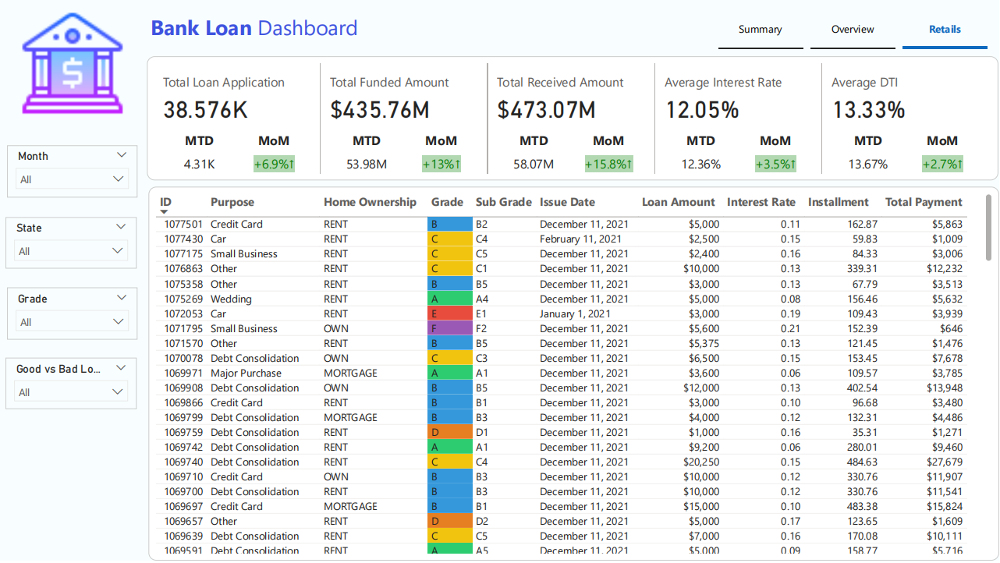

# 📊 Bank Loan Analyst Project
This repository contains code and analysis for bank loan data. The analysis is divided into several sections, each of which is described in detail below.

## 📃Table of contents
1. 🔍 Overview
2. 🎯 Objective
3. 🚀 Getting Started - Data Analysis
   - 📦 Importing Necessary Libraries
   - 📂 Loading Data
   - 🔧 Data Cleaning
   - 📈 Exploratory Data Analysis (EDA)
4. 🤖 Build Credit Risk Prediction - Machine Learning
   - 📦 Importing Necessary Libraries
   - 🔬 Model used
   - ⚙️ Process
5. 📈 Visualization
6. ✅ Conclusion
7. 📞 Contact

## 🔍 Overview
Bank loans are a crucial financial tool that enables individuals and businesses to achieve their goals and manage financial needs. However, it's essential for borrowers to understand the terms, costs, and responsibilities associated with loans to make informed financial decisions.

This project dives deep into analyzing bank loan data to uncover important insights that support better decision-making for stakeholders. We have extracted critical aspects from the data such as:
   
   - Total loan applications.
   - Total loan amounts disbursed.
   - Total amounts received. (Including interest payments)

Furthermore, we classify loans into two major categories:
   
   - **Good Loans**: Fully paid or current loans, indicating healthy repayment behavior.
   - **Bad Loans**: Loans with missed or overdue payments, potentially indicating default risk.

This classification provides a nuanced understanding of loan performance and helps in risk assessment.

We have analyzed various dimensions of the dataset, including:
    
   - **Loan purpose**.
   - **Loan terms**.
   - **Home ownership status**.
   - **Employment details**. (Length and title)
   - **Regional trends**. (Based on address state)
   - **Debt-to-Income(DTI) ratios**.

By dissecting these elements, the project reveals patterns, trends, and correlations within the loan portfolio—facilitating informed decisions and strategic planning for banks and financial institutions.

## 🎯 Objective
- Analyze important characteristics affecting loan status (Good/Bad Loan).
- Visualize data in multiple dimensions (income, region, loan term,...).
- Build a machine learning model to predict credit risk.
- Deploy Streamlit application to input data and predict.
- Design Power BI Dashboard to monitor overall risk.

By visualizing these insights, stakeholders—including data analysts, loan officers, and risk managers—can make more informed decisions, **optimize lending strategies**, mitigate risk, and enhance the overall **health of the loan portfolio**.

## 🚀 Getting Started - Data Analysis
[Data Analysis file](Data_Analysis.ipynb)
### 📦 Importing Necessary Libraries
In this section, we import the required Python libraries to perform data analysis and visualization, including `pandas`, `numpy`, `matplotlib`, and `seaborn`.

### 📂 Loading Data
#### 🗃️ The Dataset
The bank loan dataset contains **38576 records** and **24 fields** essential for understanding borrower profiles, evaluating risk, and tracking loan performance:

| **Field**                | **Description**                                                                 |
|--------------------------|---------------------------------------------------------------------------------|
| **Loan ID**              | Unique identifier for each loan, used for tracking and management.              |
| **Address State**        | Indicates borrower location; Helps assess regional trends and risks.            |
| **Application Type**     | Indicates whether the application is individual or joint.                       |
| **Employee Length**      | Duration of employment; Provides insights into job stability.                   |
| **Employee Title**       | Occupation or job title of the borrower; useful for income source verification. |
| **Grade / Sub Grade**    | Credit risk classification; supports interest rate and loan term decisions.     |
| **Home Ownership**       | Indicates financial stability and collateral potential.                         |
| **Issue Date**           | Origination date of the loan.                                                   |
| **Last Credit Pull**     | Last date of credit report access for monitoring creditworthiness.              |
| **Last Payment Date**    | Most recent payment date; tracks payment behavior.                              |
| **Loan Status**          | Current status (e.g., current, fully paid, default).                            |
| **Next Payment Date**    | Estimated next due date for repayment.                                          |
| **Member ID**            | Borrower's Identification.                                                      |
| **Purpose**              | Borrower's reason for taking the loan (e.g., debt consolidation, education).    |
| **Term**                 | Duration of the loan in months.                                                 |
| **Verification Status**  | Whether borrower's financials were verified.                                    |
| **Annual Income**        | Total annual earnings; used to evaluate repayment capacity.                     |
| **DTI (Debt-to-Income)** | Measures borrower’s financial burden.                                           |
| **Instalment**           | Fixed monthly payment (principal + interest).                                   |
| **Interest Rate**        | Cost of borrowing expressed as a percentage.                                    |
| **Loan Amount**          | Total amount borrowed.                                                          |
| **Total Acc**            | Total number of credit accounts in the borrower’s credit history.               |
| **Total Payment**        | Total amount paid back on the loan, including both principal and interest.      |

These features collectively allow for a comprehensive and insightful analysis that supports lending decisions, risk management strategies, and portfolio optimization.

### 🔧 Data Cleaning
Data processing involves cleaning and preparing the raw dataset for further analysis. This includes:
- Replacing Null values.
- Removing duplicate values. (If have)
- Converting data types.

### 📈 Exploratory Data Analysis (EDA)
EDA is the heart of this project. It includes comprehensive visualizations and summaries that provide a better understanding of the data and help identify trends and patterns.
1. Overview: Total Loan Applications, Total Funded Amount and Total Received Amount by **Overtime(Month), State(US), Loan Terms(Month), Purpose, Employee Length, Home Ownership.**
2. **Good Loans** and **Bad Loans** ratio.
3. **Correlation analysis:** DTI, Interest Rate, Annual Income vs Loan Status.

## 🤖 Build Credit Risk Prediction - Machine Learning
[Credit Risk Prediction - Maching Learning file](CreditRiskPredictionML.ipynb)
### 📦 Importing Necessary Libraries
In this section, we import the required Python libraries, including `pandas`, `numpy`, `sklearn`, `matplotlib`, and `seaborn`.

### 🔬 Model used
- Logistic Regression.
- Decision Tree.
- Random Forest.
- XGBoost.

### ⚙️ Process
- Data preprocessing: Encoding, Scaling.
- Model training and evaluation by:
  - Accuracy, Precision, Recall, F1-score
  - ROC AUC
  - Confusion Matrix
- Model explanation by SHAP (feature importance & impact)

## 📈 Visualization
### Streamlit App
- Visual interface, data entry, risk probability prediction.

### Power BI Dashboard
- **Summary Dashboard**
  - Key Performance Indicators(KPIs). 
  - Good vs. Bad loan classification.
  - Loan status categorization.
    
- **Overview Dashboard**: Total Loan Applications, Total Funded Amount and Total Received Amount by **Overtime(Month), State(US), Loan Terms(Month), Purpose, Employee Length, Home Ownership.**
    
- **Details Dashboard**: Details information about loan application. 
    

## ✅ Conclusion
- **Income, interest rate and DTI** are the three factors that have a great influence on the probability of **Bad Loan**.
- The **XGBoost** model gives the best results with **ROC AUC > 0.97**.
- **The forecasting application** works well in assessing the risk of new customers.
- The dashboard provides a comprehensive and flexible view across multiple analytical dimensions.

## 📞 Contact
For questions or suggestions, reach out via nguyenquangphuc412@gmail.com 

📅 Updated date: 02-05-2025

Thank you for visiting this project! ⭐